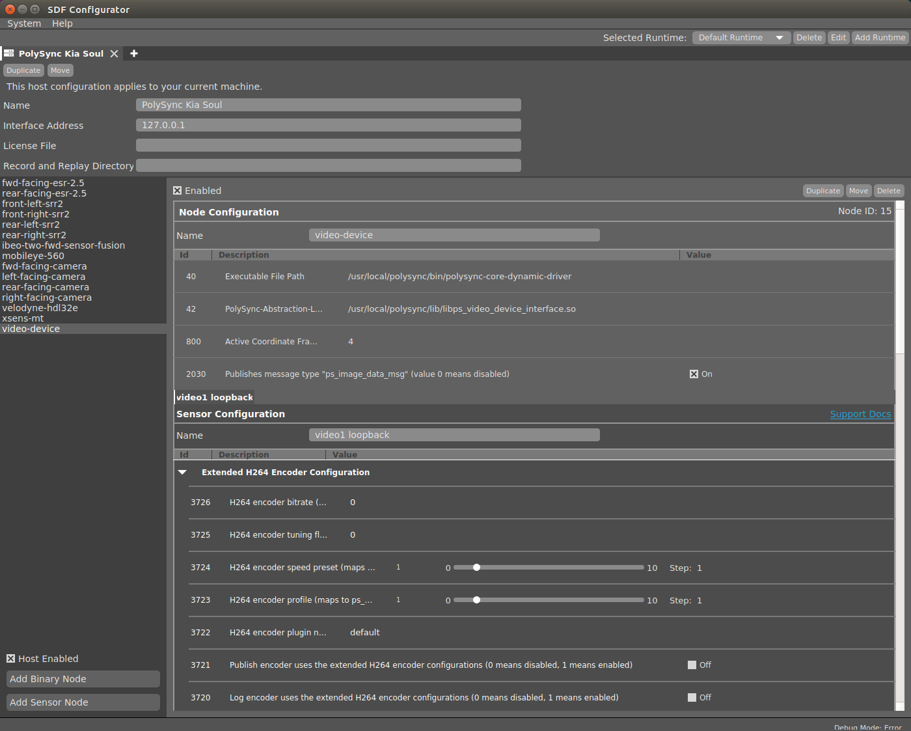
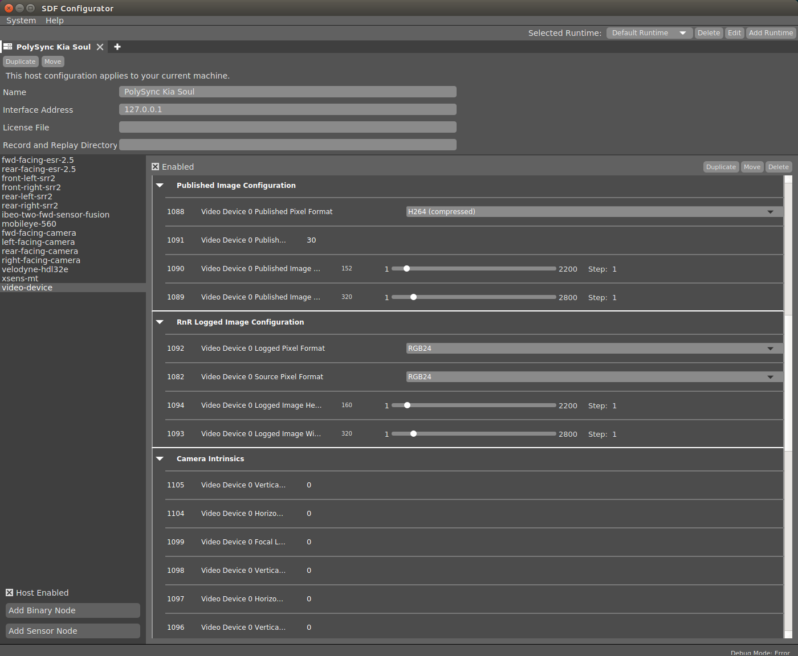
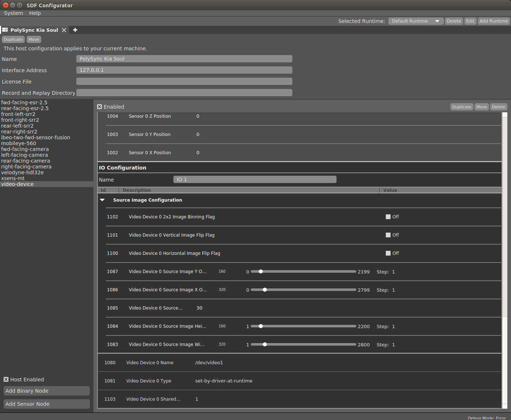
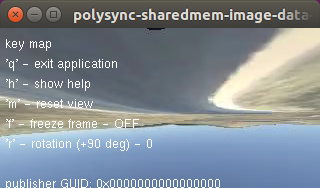

### sharedmem_image_data_viewer

This example is the same as the `image_data_viewer` example, but it uses the shared memory queue rather than the Ethernet bus to transmit the incoming image sensor data.

You must set up the shared memory queue buffer size prior to starting the application.

Note that it expects RGB24 pixel format.

### Hardware requirements

__Video device__:  Will provide instructions to set up a video loopback device.

### Install Dependencies

Packages:
1. Install PolySync: [instructions](http://docs.polysync.io/flows/getting-started/)  **Install on Ubuntu 16.04 with version 2.0.11**
2. Compile Parrot Example: [instructions](https://docs.google.com/document/d/131Ti0SX_fbEM6h9EagL0Ac8UPyWPibTcpqiG0qD392s)
3. Install AVLD: [instructions](http://askubuntu.com/questions/54032/compiling-avld-on-11-04/54055#54055).
4. Create at least one video loopback device. [instructions](https://github.com/umlaeute/v4l2loopback/wiki/Faq) and note down the device path: e.g. (/dev/video1).
5. Install ffmpeg: [instructions](https://www.howtoinstall.co/en/ubuntu/xenial/ffmpeg)
6. Install ubuntu-restricted-extras packages for h.264 decoding: `sudo apt-get install ubuntu-restricted-extras`

### Building the example

```bash
$ cd sharedmem_image_data_viewer
$ make
```

### Setup Shared Memory

```bash
$ sudo sysctl -w kernel.msgmax=4608000
$ sudo sysctl -w kernel.msgmnb=4608000
$ ipcs -l
```


### Setting up the SDF Configurator

1. Start up `polysync-core-manager` if not already done so.
2. Follow the example for [Connect USB Webcam](http://docs.polysync.io/articles/tutorials-and-examples/tutorials/connecting-to-a-sensor-webcam/), with the following changes:

    a. Set the resolution to 320x160 for all sources and publish sizes. 

    b. Set video device to the one you created in step 4 for __Install Dependencies__. 

    c. Set Video Device Shared.. to `1` 

    d. Make sure you press the `ENTER` key to save the changes and note down the Node ID of the camera.  In this example, Node ID is 15. 

     
     
     

3. Start up the video stream using __ffmpeg__.  Use the `-r` option to control the playback frame rate.  In this example, we will use the saved dataset: [https://github.com/kuasha/thunderhill_data/tree/master/dataset_sim_004_km_320x160_cones_brakes](https://github.com/kuasha/thunderhill_data/tree/master/dataset_sim_004_km_320x160_cones_brakes) 
```bash
jchen@jchen-P870DMx-G:~/SDCND/thunderhill_data/dataset_sim_004_km_320x160_cones_brakes$ ffmpeg -re -i dataset_sim_004_km_320x160_cones_brakes.mp4 -pix_fmt rgb24 -r 15 -f v4l2 /dev/video1
ffmpeg version 2.8.11-0ubuntu0.16.04.1 Copyright (c) 2000-2017 the FFmpeg developers
  built with gcc 5.4.0 (Ubuntu 5.4.0-6ubuntu1~16.04.4) 20160609
  configuration: --prefix=/usr --extra-version=0ubuntu0.16.04.1 --build-suffix=-ffmpeg --toolchain=hardened --libdir=/usr/lib/x86_64-linux-gnu --incdir=/usr/include/x86_64-linux-gnu --cc=cc --cxx=g++ --enable-gpl --enable-shared --disable-stripping --disable-decoder=libopenjpeg --disable-decoder=libschroedinger --enable-avresample --enable-avisynth --enable-gnutls --enable-ladspa --enable-libass --enable-libbluray --enable-libbs2b --enable-libcaca --enable-libcdio --enable-libflite --enable-libfontconfig --enable-libfreetype --enable-libfribidi --enable-libgme --enable-libgsm --enable-libmodplug --enable-libmp3lame --enable-libopenjpeg --enable-libopus --enable-libpulse --enable-librtmp --enable-libschroedinger --enable-libshine --enable-libsnappy --enable-libsoxr --enable-libspeex --enable-libssh --enable-libtheora --enable-libtwolame --enable-libvorbis --enable-libvpx --enable-libwavpack --enable-libwebp --enable-libx265 --enable-libxvid --enable-libzvbi --enable-openal --enable-opengl --enable-x11grab --enable-libdc1394 --enable-libiec61883 --enable-libzmq --enable-frei0r --enable-libx264 --enable-libopencv
  WARNING: library configuration mismatch
  avcodec     configuration: --prefix=/usr --extra-version=0ubuntu0.16.04.1 --build-suffix=-ffmpeg --toolchain=hardened --libdir=/usr/lib/x86_64-linux-gnu --incdir=/usr/include/x86_64-linux-gnu --cc=cc --cxx=g++ --enable-gpl --enable-shared --disable-stripping --disable-decoder=libopenjpeg --disable-decoder=libschroedinger --enable-avresample --enable-avisynth --enable-gnutls --enable-ladspa --enable-libass --enable-libbluray --enable-libbs2b --enable-libcaca --enable-libcdio --enable-libflite --enable-libfontconfig --enable-libfreetype --enable-libfribidi --enable-libgme --enable-libgsm --enable-libmodplug --enable-libmp3lame --enable-libopenjpeg --enable-libopus --enable-libpulse --enable-librtmp --enable-libschroedinger --enable-libshine --enable-libsnappy --enable-libsoxr --enable-libspeex --enable-libssh --enable-libtheora --enable-libtwolame --enable-libvorbis --enable-libvpx --enable-libwavpack --enable-libwebp --enable-libx265 --enable-libxvid --enable-libzvbi --enable-openal --enable-opengl --enable-x11grab --enable-libdc1394 --enable-libiec61883 --enable-libzmq --enable-frei0r --enable-libx264 --enable-libopencv --enable-version3 --disable-doc --disable-programs --disable-avdevice --disable-avfilter --disable-avformat --disable-avresample --disable-postproc --disable-swscale --enable-libopencore_amrnb --enable-libopencore_amrwb --enable-libvo_aacenc --enable-libvo_amrwbenc
  libavutil      54. 31.100 / 54. 31.100
  libavcodec     56. 60.100 / 56. 60.100
  libavformat    56. 40.101 / 56. 40.101
  libavdevice    56.  4.100 / 56.  4.100
  libavfilter     5. 40.101 /  5. 40.101
  libavresample   2.  1.  0 /  2.  1.  0
  libswscale      3.  1.101 /  3.  1.101
  libswresample   1.  2.101 /  1.  2.101
  libpostproc    53.  3.100 / 53.  3.100
Input #0, mov,mp4,m4a,3gp,3g2,mj2, from 'dataset_sim_004_km_320x160_cones_brakes.mp4':
  Metadata:
    major_brand     : isom
    minor_version   : 512
    compatible_brands: isomiso2avc1mp41
    encoder         : Lavf56.40.101
  Duration: 00:09:22.40, start: 0.000000, bitrate: 259 kb/s
    Stream #0:0(und): Video: h264 (High) (avc1 / 0x31637661), yuvj420p(pc), 320x160 [SAR 1:1 DAR 2:1], 256 kb/s, 30 fps, 30 tbr, 15360 tbn, 60 tbc (default)
    Metadata:
      handler_name    : VideoHandler
[swscaler @ 0x152f6c0] deprecated pixel format used, make sure you did set range correctly
Output #0, v4l2, to '/dev/video1':
  Metadata:
    major_brand     : isom
    minor_version   : 512
    compatible_brands: isomiso2avc1mp41
    encoder         : Lavf56.40.101
    Stream #0:0(und): Video: rawvideo (RGB[24] / 0x18424752), rgb24, 320x160 [SAR 1:1 DAR 2:1], q=2-31, 200 kb/s, 30 fps, 30 tbn, 30 tbc (default)
    Metadata:
      handler_name    : VideoHandler
      encoder         : Lavc56.60.100 rawvideo
Stream mapping:
  Stream #0:0 -> #0:0 (h264 (native) -> rawvideo (native))
Press [q] to stop, [?] for help
frame=   23 fps= 15 q=-0.0 size=N/A time=00:01:17.83 bitrate=N/A    
```
4. Update the dynamic node using the Node ID from step 2. 
```bash
(tensorflow) jchen@jchen-P870DMx-G:~/SDCND/thunderhill-racing/sharedmem_image_data_viewer$ polysync-core-dynamic-driver -n 15 -U
2017-03-27 20:22:33 DEBUG [1216:node.c:998] update node SDF configuration
2017-03-27 20:22:34 DEBUG [1216:polysync_node_template.c:199] exit signaled in configuration - terminating
```
5. Start the dynamic node for passing the video from the video loopback device to the Polysync shared memory.
```bash
(tensorflow) jchen@jchen-P870DMx-G:~/SDCND/thunderhill-racing/sharedmem_image_data_viewer$ polysync-core-dynamic-driver -n 15
2017-03-27 20:26:50.03s DEBUG  [video-device-] - build version 2.0.10-1487272519
2017-03-27 20:26:52.03s DEBUG  [video-device-1688914372646382] - created participant - GUID: 0x0006000F053CD5EE d(1688914372646382)
2017-03-27 20:26:52.03s DEBUG  [video-device-1688914372646382] - message types visible to this node: 47
2017-03-27 20:26:52.03s DEBUG  [video-device-1688914372646382] - transition to state: INIT - timestamp: 1490660812405382
2017-03-27 20:26:52.03s DEBUG  [video-device-1688914372646382] - coordinate frame 4 - origin (0.000,0.000,0.000) - orientation (0.0000,0.0000,0.0000)
2017-03-27 20:26:52.03s DEBUG  [video-device-1688914372646382] - using publish encoder -- src_fmt: 10 - publish fmt: 5 - w/h: 320/152
2017-03-27 20:26:52.03s DEBUG  [video-device-1688914372646382] - transition to state: OK - timestamp: 1490660812443747
```
5. Start the `polysync-sharedmem-image-data-viewer` client
```bash
jchen@jchen-P870DMx-G:~/SDCND/thunderhill-racing/sharedmem_image_data_viewer$ ./bin/polysync-sharedmem-image-data-viewer 1
2017-03-27 20:30:21.03s DEBUG  [polysync-sharedmem-image-data-viewer-] - build version 2.0.10-1487272519
2017-03-27 20:30:22.03s DEBUG  [polysync-sharedmem-image-data-viewer-281475560976986] - created participant - GUID: 0x0001000022D3325A d(281475560976986)
2017-03-27 20:30:22.03s DEBUG  [polysync-sharedmem-image-data-viewer-281475560976986] - message types visible to this node: 47
attaching to shared memory queue with key: 0x1 (1)
waiting for image data on shared memory queue with key: 0x1 (1)
found shared memory image data producer - pixel_format: 'RGB (raw)'
```

If everything goes well you should see the following video image:



**NOTE: Polysync video images are inverted by default.  Setting the `Video Device Veritcal Image Flip` flag does not result in a normal image.**

For more API examples, visit the "Tutorials" and "Development" sections in the PolySync Help Center [here](https://help.polysync.io/articles/).
